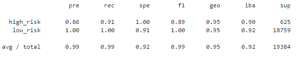
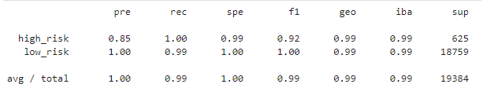
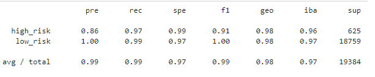
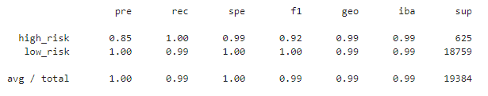
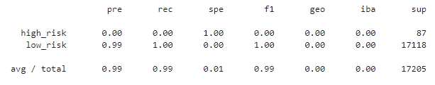
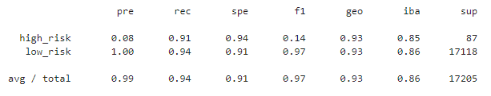
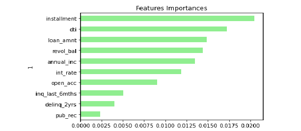

# Unit 11 Homework: Risky Business - Rachel Pierce
## November 2021

## *Instructions:*
### Two Main Tasks:
1. Resampling Technique
2. Ensemble Learning Technique

#
## *Please refer to the following documents in GitHub:*
- The **credit_risk_resampling.ipynb** and **credit_risk_ensemble.ipynb** files (open in Jupyter Lab) for code details.

#

## Part 1 
### Resampling - Completed.  
1. Simple Logistic Regression  
Balanced Accuracy Score = 0.954321  
  
       
2. Oversampling - Naive Random Oversampling  
Balanced Accuracy Score = 0.994828  
  
       
3. SMOTE Oversampling  
Balanced Accuracy Score = 0.994828 
  
       
4. Undersampling  
Balanced Accuracy Score = 0.982881
  
       
5.  Combination (SMOTEENN)  
Balanced Accuracy Score = 0.994748
  
       

#### **Part 1 Questions:**  
- Which model had the best balanced accuracy score?  
Answer:  Both the oversampling models resulted in the best balanced accuracy scores:   
    - Naive Random Oversampling Score = 0.994828  
    - SMOTE Oversampling Score = 0.994828
- Which model had the best recall score?   
Answer:  They all had 0.99 rec scores.
- Which model had the best geometric mean score?  
Answer:  Both the oversampling models and the combination model had 0.99 geo scores.

#

## Part 2
### Ensemble Learning - Completed.
1. Balanced Random Forest Classifier 
Balanced Accuracy Score =  0.5
  
       
2. Easy Ensemble Classifier
Balanced Accuracy Score =  0.926
  
       

#### **Part 2 Question:**
- Which model had the best balanced accuracy score?    
 Answer:  The Easy Ensemble had the best balanced accuracy score at 0.926.

- Which model had the best recall score?  
Answer:  The Balanced Random Forest had the best recall score at 0.99 vs Easy Ensemble at 0.94.

- Which model had the best geometric mean score?   
Answer:  The Easy Ensemble had the best geo score at 0.93.

- What are the top three features?  
Answer:  The top three features are installment, dti, and loan_amnt as shown in the graph below.  
  
      

